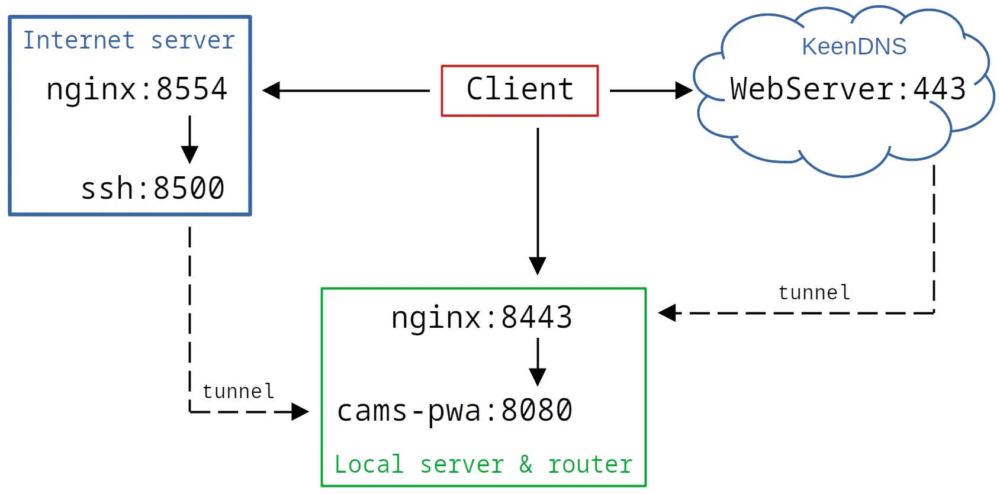

## Cams PWA


Простое веб приложение для непрерывной записи (видеорегистрации) и воспроизведения RTSP потоков с IP камер
в реальном времени.

Работает на любых современных устройствах (компьютеры, смартфоны, планшеты) под управлением любой операционной системы
(Windows, macOS, Linux, iOS, Android).

Протокол H.265 (HEVC) воспроизводится в браузерах на основе Chrome/Chromium не ниже 108 версии
при наличии аппаратного ускорения видео, H.264 — во всех браузерах.

Проект демонстрирует возможность подключения к каждой камере неограниченного количества клиентов
с использованием единственного мультиплексора (ffmpeg), создающего крайне низкую нагрузку на сервер,
и "нативное" воспроизведение видеопотока средствами HTML5.

### Возможности:

- Запись и воспроизведение изображения c любых IP камер, включая H.265+.
- Одновременный просмотр нескольких камер.
- Увеличение изображения.
- Ускоренное воспроизведение.
- Динамический детектор движения при воспроизведении записи или прямой трансляции с камеры для H.265+.
- Поддержка детектора движения средствами камеры.
- Оповещение о срабатывании детектора движения (работает в открытом приложении).
- Максимальная скорость подключения.
- Предельная простота навигации и управления.
- Низкая нагрузка на сервер и клиентское устройство (транскодирование отсутствует).
- Автоматическое восстановление подключения к камерам после потери сигнала.
- Проксирование потоков с каждой камеры неограниченному количеству клиентов.
- Одно подключение к каждой камере независимо от числа клиентов.

### Требования:

Серверная часть работает на Linux с установленными python 3.7+ (без зависимостей), ffmpeg и openssl.

### Установка

Скопируйте файл конфигурации server/config-example.py в "приватный" файл server/_config.py
и отредактируйте его, следуя комментариям.

После этого можно запустить сервер
```bash
python3 server/main.py
```
и в браузере зайти на указанный адрес, например http://localhost:8000 (по умолчанию).

### Автоматический запуск сервера во время загрузки

Создайте юнит /etc/systemd/system/cams-pwa.service, например:

```bash
[Unit]
Description=CAMS video monitoring
After=network-online.target

[Service]
ExecStart=/usr/bin/python3 /<path-to-cams-pwa>/server/main.py
User=<www_user>
Group=<www_group>

[Install]
WantedBy=network-online.target
```

*Примечание: в этом примере служба запускается после того, как сетевому интерфейсу будет назначен IP адрес.
Если в вашей системе работа сети контролируется иначе, измените значения параметров After и WantedBy.*

Затем запустите сервис:

```bash
sudo systemctl daemon-reload
sudo systemctl enable cams-pwa
sudo systemctl start cams-pwa
```

### SSL сертификат (необязательно)

Для работы PWA (прогрессивного веб приложения) требуется валидный SSL сертификат.
Также настоятельно рекомендуется работать в интернете только по защищённому протоколу HTTPS.

Но в некоторых случаях, например при проксировании через фронтенд-сервер nginx,
приложение может работать по протоколу HTTP.
В таком случае просто пропустите этот раздел и оставьте поля ssl в конфигурации пустыми.

Получить бесплатный сертификат можно в [центре сертификации Let's Encrypt](https://letsencrypt.org/ru/).
Для тестирования в локальной сети можно создать самозаверенный сертификат, например так:
```bash
sudo openssl genrsa -out rootCA.key 4096
sudo openssl req -x509 -new -nodes -key rootCA.key -sha256 -days 3650 \
    -subj "/C=ХХ/L=Nsk/O=R&K/OU=R&K/CN=R&K" -out rootCA.crt
sudo chown $(whoami):$(whoami) rootCA.key
openssl genrsa -out localhost.key 2048
openssl req -new -sha256 -key localhost.key \
    -subj "/C=ХХ/L=Nsk/O=localhost/OU=localhost/CN=localhost" -out localhost.csr
openssl x509 -req -sha256 -in localhost.csr -out localhost.crt -days 3650 \
    -CAkey rootCA.key -CA rootCA.crt -CAcreateserial -extensions SAN \
    -extfile <(printf "[SAN]\nsubjectAltName=DNS:localhost,DNS:ваш-домен,IP:127.0.0.1,IP:ваш-ip")
sudo chown root:root rootCA.key
```

В этом случае корневой сертификат rootCA.crt следует импортировать в браузер в разделе
chrome://settings/security — Настроить сертификаты — Центры сертификации — Импорт

На мобильных устройствах корневой сертификат импортируется в разделе "Безопасность" в настройках системы.


### Интерфейс


Экран просмотра камеры. Содержит следующие элементы управления:

1. Кнопка "Назад".
2. Кнопка "События" (опционально). Включает просмотр изображений, записанных детектором движения камеры.
3. Кнопки "Перемотка назад".
4. Кнопка "Пуск/Стоп".
5. Кнопка "Ускоренное воспроизведение".
6. Кнопка "Динамический детектор движения". Работает для протоколов с высокой степеню сжатия, например, H.265+.
7. Кнопки "Перемотка вперед".
8. Кнопка "Оповещение о движении" (опционально). Включает уведомления о срабатывании любого
из настроенных детекторов движения.
9. Ползунок шкалы времени. Точки на шкале соответствуют числу дней записи.

При прямой трансляции кнопки 5...7 неактивны.

Экран "События" дополнительно содержит диаграмму числа событий по дням, помогающую ориентироваться на шкале времени.

### Детектор движения средствами камеры

Приложение поддерживает возможность записи событий, обнаруженных камерой.
Ниже приведены настройки детектора движения на примере камеры Hikvision.
Интерфейс и параметры настроек могут сильно отличаются в зависимости от производителя,
но общая последовательность действий такова:

1. Включите детектор движения и настройте охранные зоны:


2. Выберите сохранение результатов на собственный сервер:


3. Включите "активацию захвата изображения по событию" (Event-Triggered Snapshot):


4. Настройте доступ к серверу:


В приведенном примере использован FTP сервер.
Родительская папка camera_folder должна соответствовать настройке cameras[hash][folder]
в файле server/_config.py приложения,
имя дочерней папки должно начинаться с любой буквы.
Приложение обеспечивает ежедневную ротацию сохраненных камерой изображений.
Доступ к этому архиву предоставляется на экране "События".

***Внимание!***
*При настройке FTP сервера настоятельно рекомендуется ограничить доступ пользователя ftp_user (режим chroot)
одной папкой events_path (см. server/_config.py).*

### Пример использования


В этом примере служба cams-pwa установлена на локальном сервере с "серым" IP адресом.
Для доступа к серверу через интернет может использоваться сервер с "белым" IP или "облако" KeenDNS.
Для обслуживания внешних запросов на локальном сервере установлен туннель ssh -R.
Использование фронтенд-сервера nginx не обязательно,
но полезно для обслуживания статических файлов и для проксирования дополнительных заголовков,
таких как запрашиваемое имя хоста или IP клиента.

### Chromium в Linux

В зависимости от дистрибутива Linux, для включения аппаратного декодирования в Chromium и браузерах на его основе
может потребоваться установка флага
```bash
--enable-features=VaapiVideoDecodeLinuxGL
```

Для постоянного включения флага можно, например, добавить этот аргумент в строке Exec в файле chromium.desktop.

### Возможные проблемы

Если видео не воспроизводится на вашем компьютере, запишите образец видео в файл и откройте его в браузере напрямую.
Пример команды записи файла test.mp4 с оригинальным видеокодеком (-c:v copy) и отключённым звуком (-an) длительностью 4 секунды (-t 4):
```bash
ffmpeg -i rtsp://<адрес_камеры> -c:v copy -an -t 4 test.mp4
```

1. Если тестовый файл не воспроизводится, проблема на стороне браузера.
В этом случае проверьте, включено ли в настройках браузера аппаратное ускорение графики и поддерживает ли его ваш компьютер.
Убедитесь, что по адресу [chrome://gpu/](chrome://gpu/) в разделе "Video Acceleration Information" присутствуют строки вида "Decode hevc main".
Если никакие действия не помогают, простым решением может быть переключение кодировки видеопотока на H.264 в настройках камеры.


2. Если файл воспроизводится в браузере, проверьте следующее:

* Верно ли указаны кодеки в поле "codecs" в файле конфигурации _config.py.
Например, для видеокамер с поддержкой H.265 может сработать кодек "hev1.1.6.L120.0", а для H.264 - "avc1.42001f".
Точное значение кодека для записанного файла можно получить, например, командой
```bash
MP4Box -info test.mp4  2>&1 | grep RFC6381 | awk '{print $4}' | paste -sd , -
```

* Проверьте, совместимы ли указанные кодеки с вашим браузером.
Поскольку приложение не декодирует изображение, а только передаёт данные в GPU, в качестве водеокодека можно указать любое совместимое значение.
Проверить совместимость ваших кодеков можно, набрав во вкладке "консоль" в "инструментах разработчика" браузера команду MediaSource.isTypeSupported(), например:
```bash
MediaSource.isTypeSupported('video/mp4; codecs="avc1.42001а,mp4a.40.2"')
```

* Для камер со звуком проверьте, не блокирует ли воспроизведение звуковой канал.
В случае проблем с аудиопотоком можно либо записывать звук в кодировке AAC (параметр -c:a aac), либо отключить звук (параметр -an).


Подробнее о кодеках можно узнать, например, [тут](https://developer.mozilla.org/en-US/docs/Web/Media/Formats/Video_codecs),
а о работе Media Source Extensions — [тут](https://developer.mozilla.org/en-US/docs/Web/API/Media_Source_Extensions_API).


### Дополнительные сведения

Подробное описание приложения: [habr.com/ru/post/715016](https://habr.com/ru/post/715016/)

*Copyright (c) 2023-2024 vladpen under MIT license. Use it with absolutely no warranty.*
