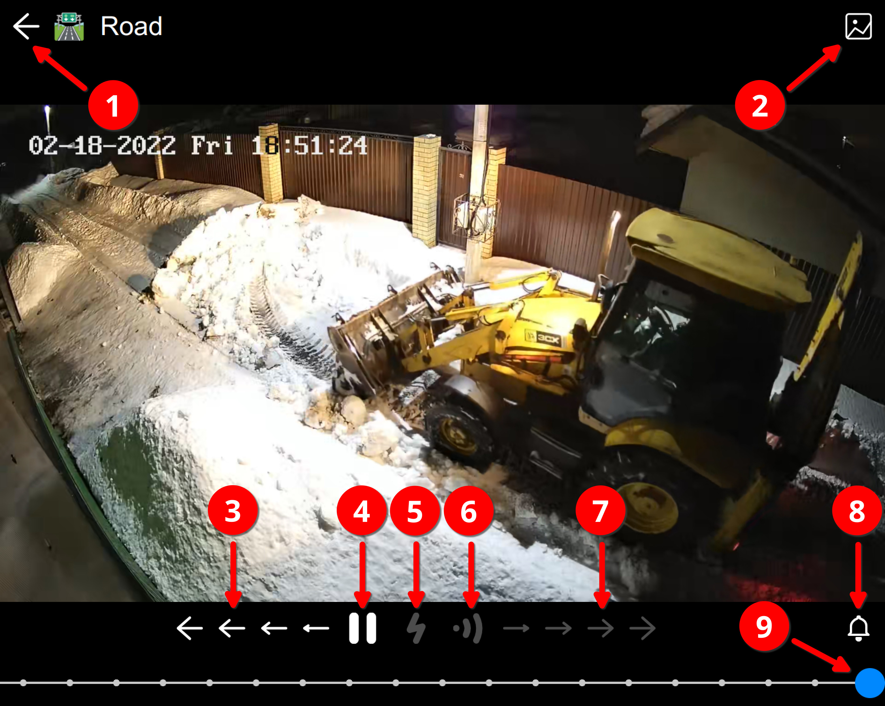
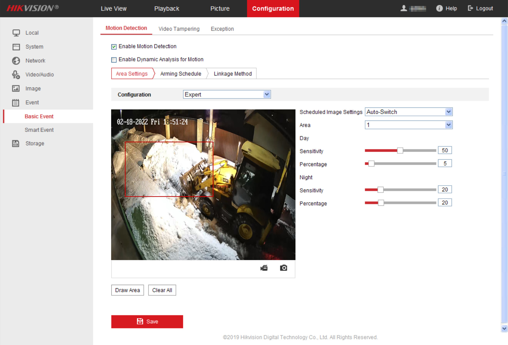
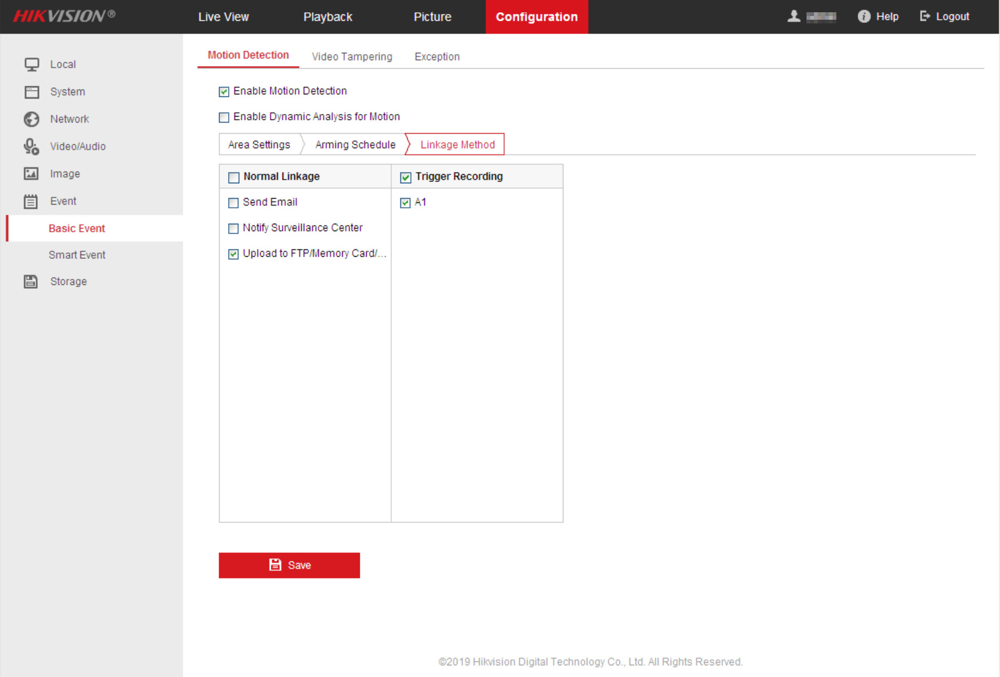
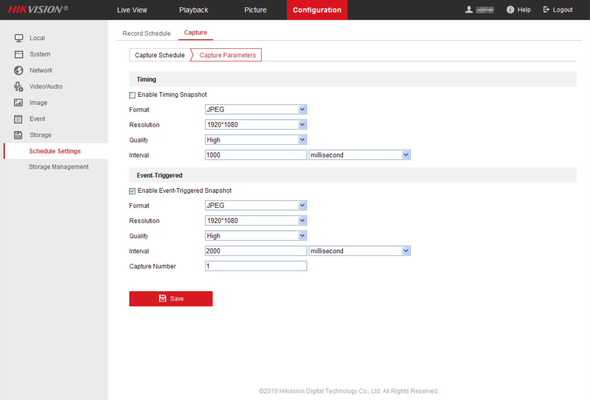
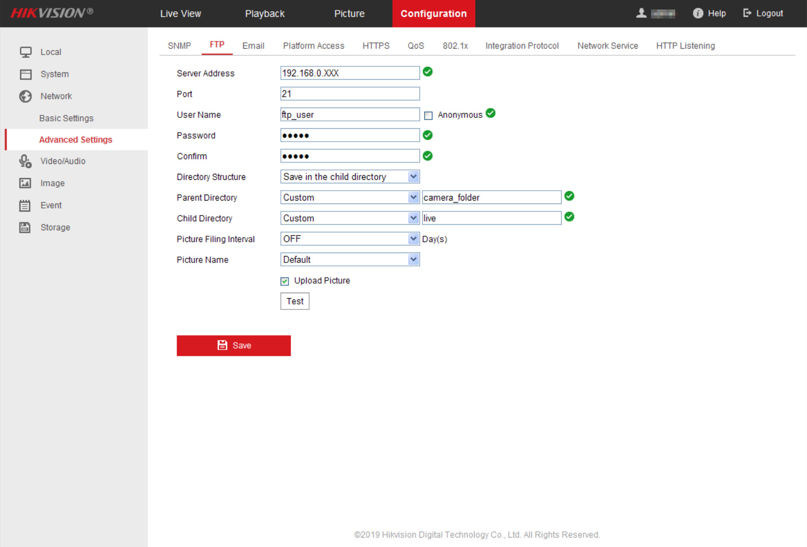

## Cams PWA


Простое веб приложение для непрерывной записи (видеорегистрации) и воспроизведения RTSP потоков с IP камер в реальном времени.
Протокол H.265 (HEVC) воспроизводится в браузерах на основе Chrome/Chromium не ниже 106 версии (для Linux - не ниже 108 версии)
при наличии аппаратного ускорения видео, H.264 — в любом браузере.

Проект демонстрирует возможность подключения к каждой камере неограниченного количества клиентов
с использованием единственного мультиплексора (ffmpeg), создающего крайне низкую нагрузку на сервер,
и "нативное" воспроизведение видеопотока средствами HTML5.

### Возможности:

- Запись и воспроизведение изображения c любых IP камер, включая H.265+.
- Одновременный просмотр нескольких камер.
- Увеличение изображения.
- Ускоренное воспроизведение.
- Динамический детектор движения при воспроизведении записи или прямой трансляции с камеры для H.265+.
- Поддержка детектора движения средствами камеры.
- Оповещение о срабатывании детектора движения (работает в открытом приложении).
- Максимальная скорость подключения.
- Предельная простота навигации и управления.
- Низкая нагрузка на сервер и клиентское устройство (транскодирование отсутствует).
- Автоматическое восстановление подключения к камерам после потери сигнала.
- Проксирование потоков с каждой камеры неограниченному количеству клиентов.
- Одно подключение к каждой камере независимо от числа клиентов.

### Требования:

Серверная часть работает на Linux с установленными python 3.7+ (без зависимостей), ffmpeg и openssl.

### Установка

Скопируйте файл конфигурации server/config-example.py в "приватный" файл server/_config.py и отредактируйте его, следуя комментариям.

Для работы PWA (прогрессивного веб приложения) требуется валидный SSL сертификат.
Для тестирования в локальной сети можно создать самозаверенный сертификат, например, так:
```bash
sudo openssl genrsa -out rootCA.key 4096
sudo openssl req -x509 -new -nodes -key rootCA.key -sha256 -days 3650 \
    -subj "/C=ХХ/L=Nsk/O=R&K/OU=R&K/CN=R&K" -out rootCA.crt
sudo chown $(whoami):$(whoami) rootCA.key
openssl genrsa -out localhost.key 2048
openssl req -new -sha256 -key localhost.key \
    -subj "/C=ХХ/L=Nsk/O=localhost/OU=localhost/CN=localhost" -out localhost.csr
openssl x509 -req -sha256 -in localhost.csr -out localhost.crt -days 3650 \
    -CAkey rootCA.key -CA rootCA.crt -CAcreateserial -extensions SAN \
    -extfile <(printf "[SAN]\nsubjectAltName=DNS:localhost,DNS:ваш-домен,IP:127.0.0.1,IP:ваш-ip")
sudo chown root:root rootCA.key
```

В этом случае корневой сертификат rootCA.crt следует импортировать в браузер в разделе
chrome://settings/security — Настроить сертификаты — Центры сертификации — Импорт

На мобильных устройствах корневой сертификат импортируется в разделе "Безопасность" в настройках системы.

Теперь можно запустить сервер
```bash
python3 server/main.py
```
и в браузере зайти на указанный адрес, например https://localhost:8000 (по умолчанию).

### Автоматический запуск сервера во время загрузки

Создайте юнит /etc/systemd/system/cams-pwa.service

```bash
[Unit]
Description=CAMS video monitoring

[Service]
ExecStart=/usr/bin/python3 /<path-to-cams-pwa>/server/main.py
User=<www_user>
Group=<www_group>

[Install]
WantedBy=multi-user.target
```

Запустите сервис:

```bash
sudo systemctl daemon-reload
sudo systemctl enable cams-pwa
sudo systemctl start cams-pwa
```

### Интерфейс



Экран просмотра камеры. Содержит следующие элементы управления:

1. Кнопка "Назад".
2. Кнопка "События" (опционально). Включает просмотр событий, записанных детектором движения камеры.
3. Кнопки "Перемотка назад".
4. Кнопка "Пуск/Стоп".
5. Кнопка "Ускоренное воспроизведение".
6. Кнопка "Динамический детектор движения". Работает для протоколов с высокой степеню сжатия, например, H.265+.
7. Кнопки "Перемотка вперед".
8. Кнопка "Оповещение о движении" (опционально). Включает уведомления о срабатывании любого из настроенных детекторов движения.
9. Ползунок шкалы времени. Точки на шкале соответствуют числу дней записи.

При прямой трансляции кнопки 5...7 неактивны.

Экран "События" дополнительно содержит диагамму числа событий по дням, прмогающую ориентироваться на шкале времени.

### Детектор движения средствами камеры

Приложение поддерживает возможность записи событий, обнаруженных камерой.
Ниже приведены настройки детектора движения на примере камеры Hikvision.
Интерфейс и параметры настроек могут сильно отличаются в зависимости от производителя, но общая последовательность действий такова:

1. Включите детектор движения и настройте охранные зоны:


2. Выберите сохранение результатов на собственный сервер:


3. Включите "активацию захвата изображения по событию" (Event-Triggered Snapshot):


4. Настройте доступ к серверу:


В приведенном примере использован FTP сервер.
Родительская папка camera_folder должна соответствовать настройке cameras[hash][folder] в файле server/_config.py приложения, имя дочерней папки должно начинаться с любой буквы.
Приложение обеспечивает ежедневную ротацию сохраненных камерой изображений.
Доступ к этому архиву предоставляется на экране "События".

***Внимание!***
*При настройке FTP сервера настоятельно рекомендуется ограничить доступ пользователя ftp_user (режим chroot) одной папкой events_path (см. server/_config.py).*

### Дополнительные сведения

Подробное описание приложения: [habr.com/ru/post/715016](https://habr.com/ru/post/715016/)

*Copyright (c) 2023 vladpen under MIT license. Use it with absolutely no warranty.*
